---
hide:
  - toc
---
# Deployments

## Overview

GamerHouse uses a fully automated CI/CD pipeline built on GitHub Actions. Every push to the `dev` branch (or merged pull request) triggers a test run, a Docker image build, and deployment to an AWS EC2 instance.

The production runtime is a Docker Compose stack with five services: a Django/Gunicorn web server, PostgreSQL, Redis, a Celery worker, and Celery Beat. Nginx on the EC2 host acts as a reverse proxy and serves static files directly.

## Flow
{ style="max-height: 90vh;  display: block; margin: auto;" }

## Tools for CI/CD - Docker

- **Docker**: Containerizing the application for consistency.
- **Docker Compose**: Orchestrating our multi-container architecture.
- **GitHub Actions**: Our primary CI/CD automation platform.
- **GHCR**: Storing and managing our Docker images.
- **uv**: Fast Python package manager for dependencies.
- **Gunicorn**: Production WSGI server running our Django app.
- **New Relic**: Provides robust application performance monitoring in production.

## Pipeline Triggers

Defined in `.github/workflows/deploy.yml`:

| Event | Condition |
|---|---|
| `push` | Any push to `dev` or `ci-test` branch |
| `pull_request` | PR closed against `dev` **and** `merged == true` |
| `workflow_dispatch` | Manual trigger from the GitHub Actions UI |

## CI Test Job (`run-tests`)

### Steps

| # | Step | Detail |
|---|---|---|
| 1 | Checkout repository | `actions/checkout@v4` |
| 2 | Install uv | `astral-sh/setup-uv@v5` with layer caching |
| 3 | Set up Python 3.13 | `uv python install` (version from `pyproject.toml`) |
| 4 | Install dependencies | `uv sync --all-extras --dev` (locked versions) |
| 5 | Run Pytest | `uv run pytest` — full suite against live service containers |

> **Gate:** The `build-and-deploy` job only runs if this job succeeds.

## Build & Push Job (`build-and-deploy`)

Requires `packages: write` permission to push to GHCR.

### Build steps

| # | Step | Action |
|---|---|---|
| 1 | Login to GHCR | `docker/login-action@v3` using `GITHUB_TOKEN` |
| 2 | Extract metadata | `docker/metadata-action@v5` → produces `sha-{SHA}` and `latest` tags |
| 3 | Set up Docker Buildx | `docker/setup-buildx-action@v3` |
| 4 | Build & push | `docker/build-push-action@v6` with registry cache |

## Deploy to EC2 (`deploy.sh`)

After the image is pushed, the workflow SSHs into EC2 (`appleboy/ssh-action@v1`, 600s timeout) and runs `scripts/deploy.sh`. All GitHub Secrets are exported as environment variables before the script runs.

The script is **idempotent** — every section checks whether the resource already exists before acting.

### System bootstrap *(first run only)*

```bash
nginx
certbot + python3-certbot-nginx
docker          # via get.docker.com convenience script
docker compose  # v2 plugin (docker-compose-plugin)
newrelic-infra  # via official New Relic APT repo
```

### Image pull and tagging

```bash
echo "$GHCR_TOKEN" | docker login ghcr.io -u "$GHCR_USER" --password-stdin
docker pull "$IMAGE_NAME"                        # ghcr.io/.../gamerhouse:latest
docker tag  "$IMAGE_NAME" gamerhouse_web:latest  # local alias for Compose
docker image prune -f --filter "until=24h"       # free disk space
```

### Compose stack restart

```bash
docker compose -f /opt/gamerhouse/docker-compose.yml up -d --remove-orphans
```

Only recreates containers whose image or config has changed. `--remove-orphans` removes containers for services no longer in the Compose file.

### Health check

```bash
curl -sf "http://localhost:8000/health/"
```
If the app does not return HTTP 200 within 150 seconds, the deploy **aborts with a non-zero exit code**, failing the GitHub Actions step and leaving the old container running.

### Nginx configuration *(first run only)*

The Nginx config proxies all traffic to `127.0.0.1:8000` (Docker web container).

### SSL certificate *(first run only)*

```bash
sudo certbot --nginx -d "$DOMAIN" \
  --non-interactive --agree-tos \
  --email "${EMAIL_HOST_USER}" \
  --redirect
```

Certbot modifies the Nginx config to add HTTPS and redirect HTTP → HTTPS. A daily cron is added:
